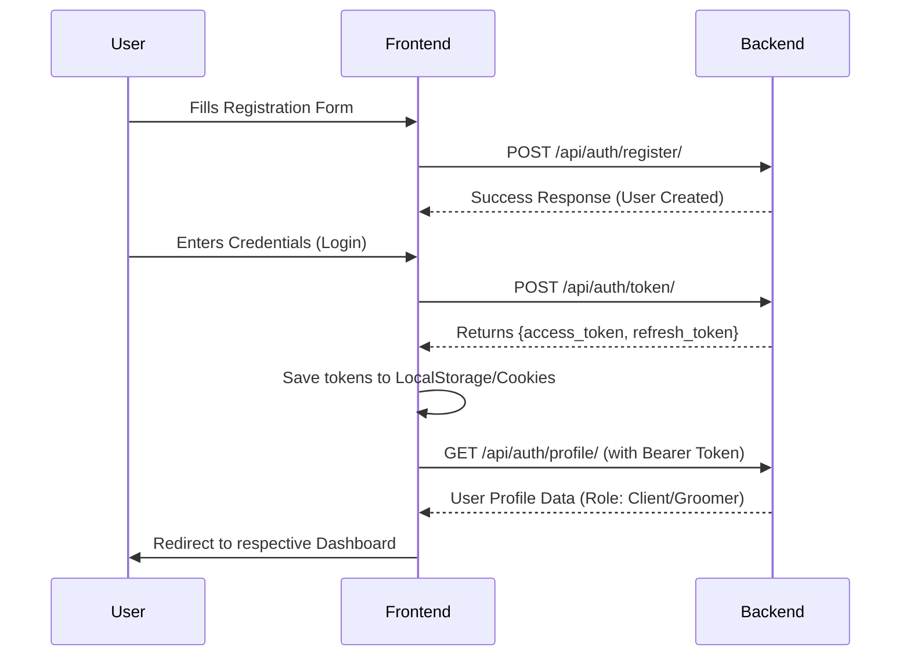
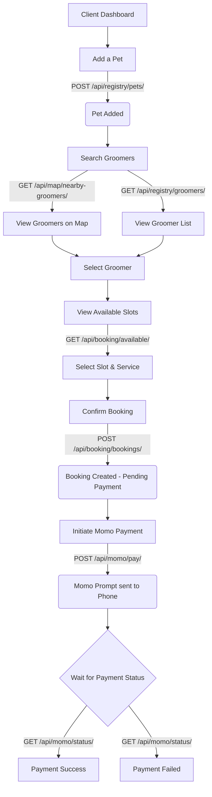
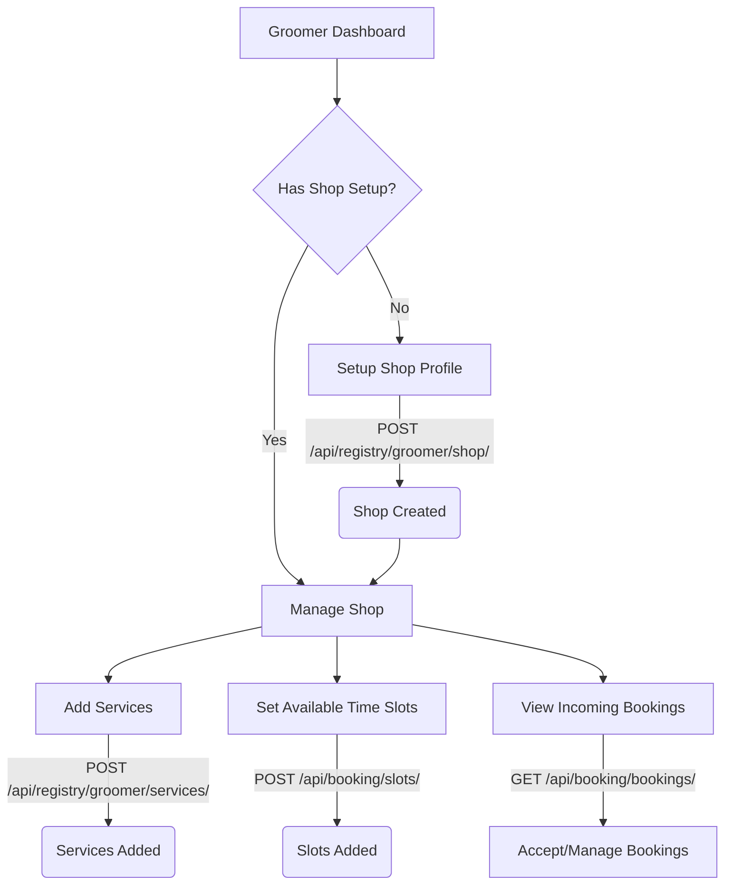

# Pawpal-Ghana - Frontend Developer Guide

Welcome to **Pawpal-Ghana**! This guide is designed to provide the frontend developer with a comprehensive understanding of the backend architecture, API endpoints, and the core user flows necessary to build the UI.

The backend is built using **Django REST Framework (DRF)**. It provides robust RESTful APIs, uses JWT for authentication, and integrates with Mobile Money (Momo) for payments.

---

## 📚 API Documentation (Swagger)

The backend uses `drf-spectacular` to automatically generate OpenAPI documentation. 
Once the backend is running, you can access the full interactive API documentation at:
- **Swagger UI:** `http://localhost:8000/api/docs/`
- **Schema:** `http://localhost:8000/api/schema/`

*Use the Swagger UI to test endpoints and see the exact request/response JSON payloads.*

---

## 🔌 API Endpoints Overview

The backend is split into several modular apps. All endpoints are prefixed with `/api/`.

### 1. Authentication (`/api/auth/`)
Handles user registration, login, and profile management.
- `POST /api/auth/register/` - Register a new user (Client or Groomer).
- `POST /api/auth/login/` - Login user.
- `POST /api/auth/token/` - Obtain JWT access and refresh tokens.
- `POST /api/auth/token/refresh/` - Refresh the JWT access token.
- `GET/PUT /api/auth/profile/` - View or update the logged-in user's profile.

### 2. Registry (`/api/registry/`)
Handles core entities like Pets and Groomer Shops.
- **Pets (For Clients):**
  - `GET/POST /api/registry/pets/` - List your pets or register a new pet.
  - `GET/PUT/DELETE /api/registry/pets/<id>/` - Manage a specific pet.
- **Groomer Shop (For Groomers):**
  - `POST /api/registry/groomer/shop/` - Setup a new groomer shop profile.
  - `GET/PUT /api/registry/groomer/shop/me/` - Update the logged-in groomer's shop profile.
  - `GET/POST /api/registry/groomer/services/` - List/Create services offered by the groomer.
- **Public:**
  - `GET /api/registry/groomers/` - Public list of all available groomers.

### 3. Booking (`/api/booking/`)
Handles groomer availability and client appointments.
- `GET/POST /api/booking/slots/` - Manage time slots (Groomer).
- `GET /api/booking/slots/<id>/` - Retrieve a specific time slot.
- `GET /api/booking/available/` - List all currently available time slots for booking.
- `GET/POST /api/booking/bookings/` - Create a new booking or view your bookings.
- `GET/DELETE /api/booking/bookings/<id>/` - View or cancel a specific booking.

### 4. Map (`/api/map/`)
Handles location-based queries.
- `GET /api/map/nearby-groomers/` - Get a list of groomers near the client's location.

### 5. Mobile Money Payments (`/api/momo/`)
Handles integration with the Momo payment gateway.
- `POST /api/momo/pay/` - Initiate a mobile money payment for a booking.
- `GET /api/momo/status/<transaction_id>/` - Check the status of an ongoing payment.

---

## 🌊 Core User Flows

Here are the primary user journeys you need to build UIs for.

### 1. Authentication Flow
Both Clients and Groomers use the same authentication endpoints but will have different roles on the frontend.



### 2. Client Flow (Finding & Booking a Groomer)
This is the main journey for pet owners (clients).



### 3. Groomer Flow (Shop Setup & Managing Bookings)
This is the main journey for pet groomers.



---

## 🛠️ Important Implementation Details for Frontend

1. **Authentication Header:**
   All protected routes require an `Authorization` header.
   ```javascript
   headers: {
     'Authorization': `Bearer ${access_token}`
   }
   ```

2. **Token Refresh:**
   Implement an Axios interceptor (or similar) to automatically call `POST /api/auth/token/refresh/` when the `access_token` expires (returns 401).

3. **Momo Payment UX & Payload:**
   When calling `POST /api/momo/pay/`, the **only payload required** is the `booking_id`.
   ```json
   {
     "booking_id": 15
   }
   ```
   *Why no phone number or amount?* The backend automatically extracts the exact amount from the groomer's service associated with the booking, preventing frontend tampering. It also identifies the payer directly from the JWT `Authorization` header.
   After the endpoint is called, the user will receive a USSD prompt on their phone. The frontend should display a loading spinner or a "Please check your phone" screen while polling `GET /api/momo/status/<transaction_id>/` every few seconds to verify if the payment was successful.

4. **Map Integration:**
   For the `GET /api/map/nearby-groomers/` endpoint, you will likely need to request the user's geolocation via the browser (`navigator.geolocation`) and send their coordinates (latitude and longitude) as query parameters.

5. **Role-Based UI:**
   Ensure the frontend UI adapts based on whether the logged-in user is a **Client** or a **Groomer**. Check their role via the `/api/auth/profile/` endpoint immediately after login.
